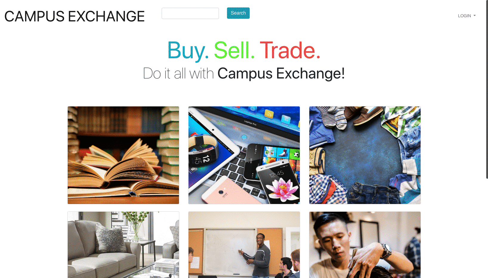
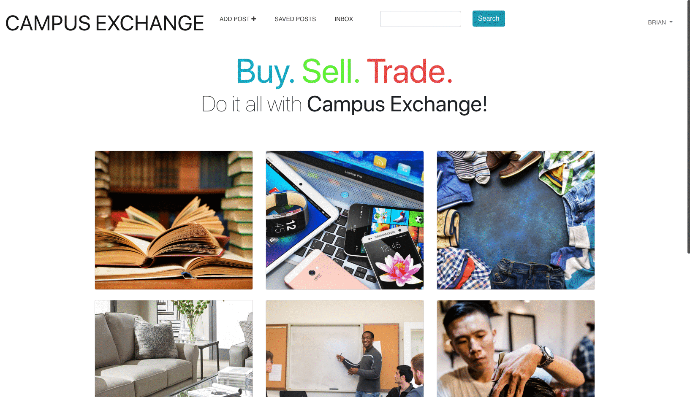
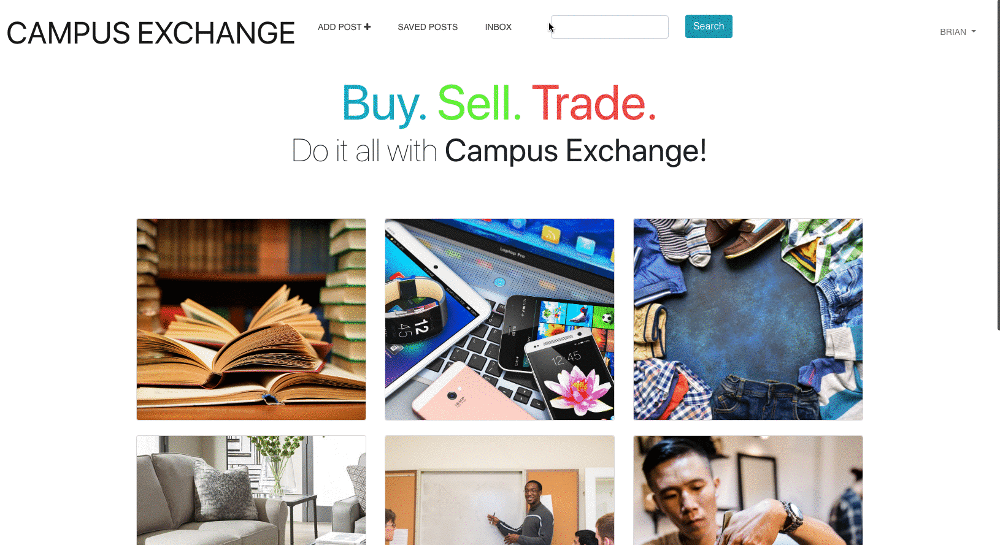

# Campus Exchange

A web application done with a team of 4 that is similar to craigslist where users can buy/sell textbooks, clothes, electronics, and furniture with other students within the same college campus. 

## Problem
At the end of the quarter or school year, students have leftover items such as textbooks, clothes, electronics, and furniture that they have no use for. At the same time, there are other students who need these items but aren’t willing to pay full price for them. Thus, there was an opportunity to connect such students together and  Campus Exchange was created!

## Solution
Campus Exchange is a platform where students can buy and sell goods/services securely with other students within the same college campus. 
Only students with UCSC.edu emails will be able to make accounts. There they will be able to post items such as books, electronics, clothes, furniture or services such as haircuts, tutors, etc.

## Features
- Sign up page
	* Must have ucsc.edu email
- Profile page
	* Picture
	* Location
	* Show current postings
	* Sellers review
- Home page
	* Categories list
	* Menu bar on top
	* Search bar
- Category feed
	* List posts
	* Sort by option (name, location, price, etc)


## Screenshots

###### Login and Homepage
```

```

###### Using Non-UCSC Email
'''

'''

##### Add Post
'''

'''

###### View Post & Send Message
'''

'''

##### View Messages
'''

'''

##### Search Bar
'''

'''

##### Saved Posts
'''

'''

##### All Category
'''

'''

## Built With
* web2Py framework
* Bootstrap 
* Font awesome
* Pythonanywhere
* GitHub


